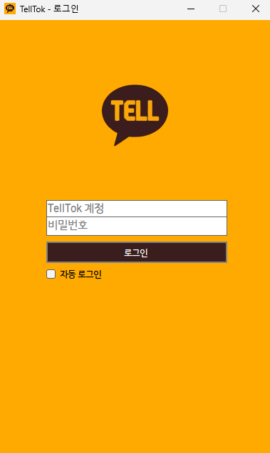
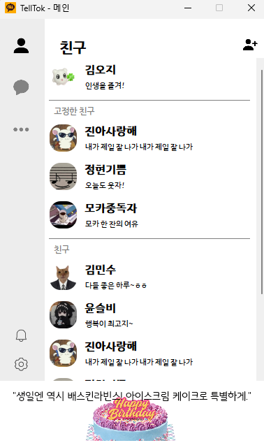
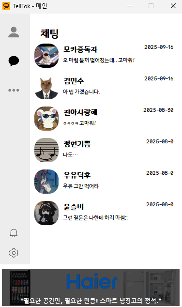
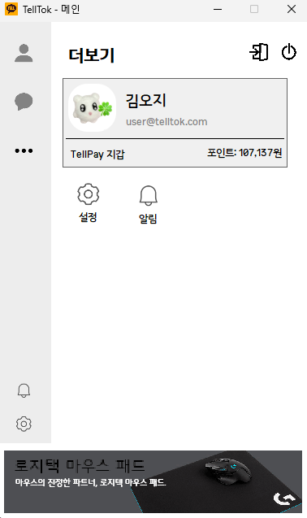
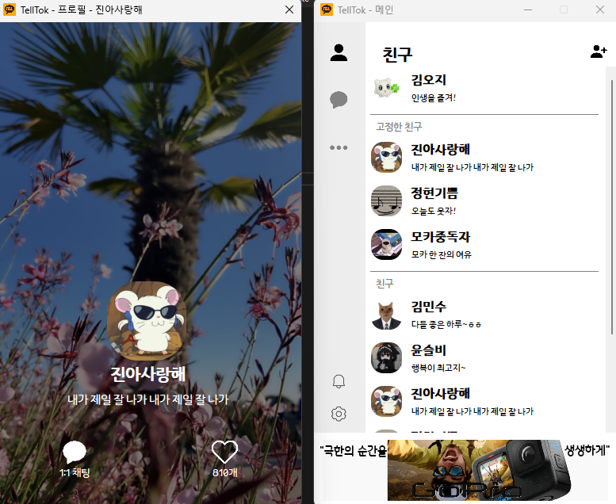
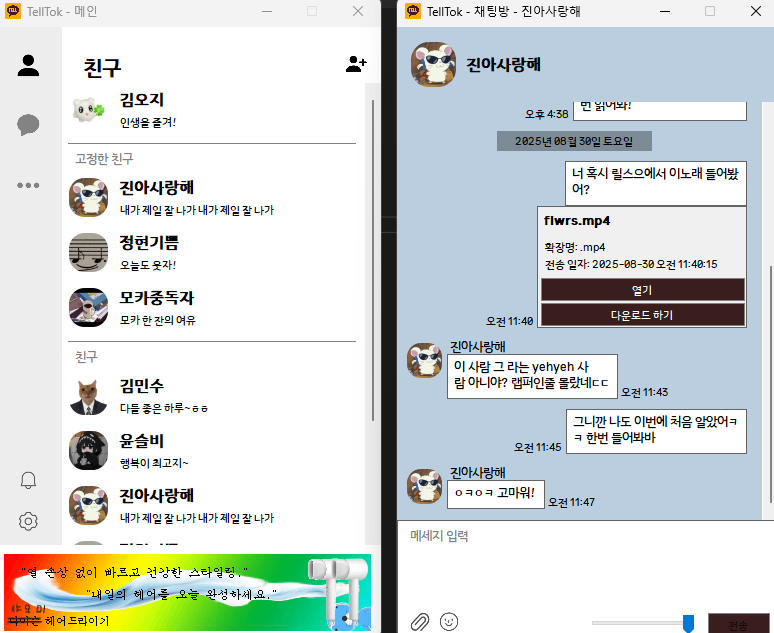
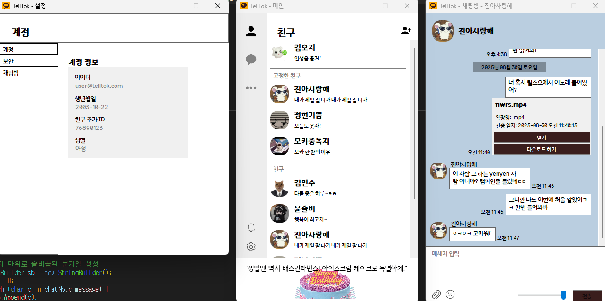

# TellTok

> **2025년 전국기능경기대회 정보기술 직종 1과제(C#) 출전 작품**  
> 강원도 대표로 출전하여 제작한 Windows 기반 메신저 프로그램입니다.  
> 카카오톡의 UI/UX에서 영감을 받아, 제한된 대회 환경 내에서 사용자 편의성과 UI 완성도를 극대화하는 데 초점을 두었습니다.

## 프로젝트 소개

**TellTok**은 전국기능경기대회 정보기술 직종 과제 요구사항에 따라 제작된  
C# WinForms 기반 메신저 애플리케이션입니다.

본 대회에서는 **MSSQL을 활용한 데이터 처리**가 필수 조건으로 주어졌으며,  
네트워크 서버 구축이 제한된 환경에서 과제가 진행되었습니다.  
이에 따라 별도의 백엔드 서버 없이  
**Client-to-DB(MSSQL) 직접 연결 방식**으로 프로그램을 설계·구현하였습니다.

## 개발 기간
- **2024.12 ~ 2025.06**

## 주요 구현 포인트

- 카카오톡 기반의 **UI/UX**
- 카카오톡 스타일 채팅 레이아웃 및 말풍선 구성
- 폼 간 상태 공유를 통한 **UI 동기화 처리**
- DB 기반 메시지 송·수신 구조 설계

## 문제지

[PDF 문제지](./전국기능경기대회%20강원도%201과제.pdf)  [HWP 문제지](./전국기능경기대회%20강원도%201과제.hwp)

## 기술 스택

- **Language:** C# (.NET Framework 4.7.2)
- **UI Framework:** Windows Forms (WinForms)
- **Database:** Microsoft SQL Server (MSSQL)
- **IDE / Tools:** Visual Studio, SQL Server Management Studio (SSMS)

## 실행 화면

## 참고 사항

- 본 프로젝트는 **학습 및 포트폴리오 목적**으로 공개되었습니다.
- 대회 과제 특성상 일부 구조는 일반적인 실무 패턴과 다를 수 있습니다.

## License

This project is licensed under the  
**Creative Commons Attribution-NonCommercial 4.0 International License (CC BY-NC 4.0)**.

Commercial use is not permitted.  
See the [LICENSE](./LICENSE) file for details.

